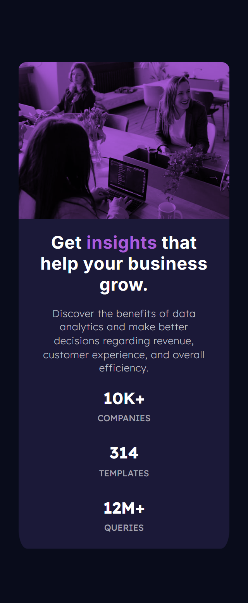

Frontend Mentor - Stats preview card component solution
This is a solution to the Stats preview card component challenge on Frontend Mentor.

Overview
The challenge
Users should be able to:

View the optimal layout depending on their device's screen size

!Desktop View  

!Mobile View  

Links
Solution URL:https://github.com/Fabiha517/stats-preview-card.git

Live Site URL: https://fabiha517.github.io/stats-preview-card/

Built with
Semantic HTML5 markup

CSS custom properties

Flexbox

Mobile-first workflow

Media queries for responsiveness

What I learned
I learned how to create a responsive card layout using Flexbox. One interesting part was overlaying a color on the image using background-blend-mode: multiply, which added the desired purple tint without using extra HTML elements. I also practiced centering layouts across all screen sizes, especially wide screens like 2560px.

Continued development
I want to keep improving my layouts on ultra-wide screens and make better use of relative units instead of hardcoding heights. I also plan to explore more about dynamic viewport units like svh and dvh to make things more adaptable.

Author
Frontend Mentor - @Fabiha517
